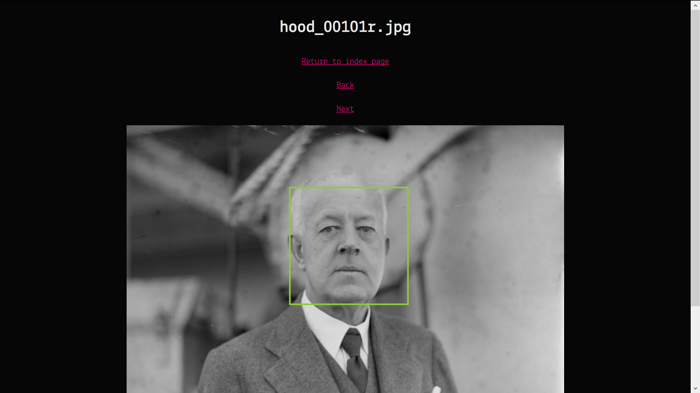

# dxlab-young-ct-award

This project contains work done for the [Young Creative Technologist award](https://dxlab.sl.nsw.gov.au/blog/young-ct-winner). The end product of this
project is a proof of concept that tests AWS Rekognition against an image
collection stored in S3, displays bounding boxes around recognised faces, and
searches for similar faces in an image collection.

## Project setup

The project runs so that the facial bounding boxes are stored in JSON files
alongside images in S3. Steps to create the JSON files are as below:

1.  Ensure that images are uploaded to an S3 bucket. Only png and jpeg images
    are supported by AWS Rekognition.
2.  Set the name of the S3 bucket in [script on this line](https://github.com/slnsw/dxlab-young-ct-award/blob/master/rekognition-init/script.js#L3),
    and set the desired name of the Rekognition face collection [here](https://github.com/slnsw/dxlab-young-ct-award/blob/master/rekognition-init/script.js#L4).
3.  Navigate to the directory and run the script with `npm start`.

## Architecture

The web application makes use of AWS for the backend. Images are hosted on S3, and
facial detection and recognition is done by Rekognition. Calls to these services
are handled through `imageService`, which uses [serverless](https://serverless.com/)
to host endpoints for the front end.

The front end is built using React.
